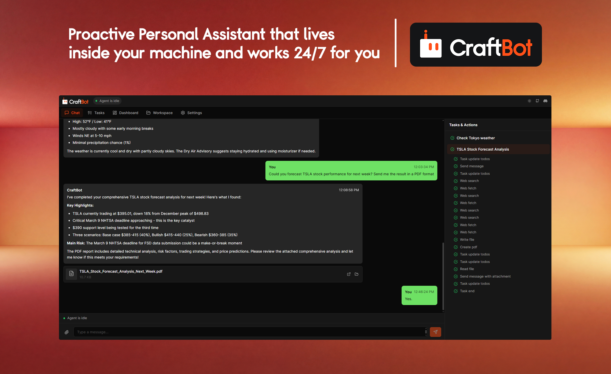
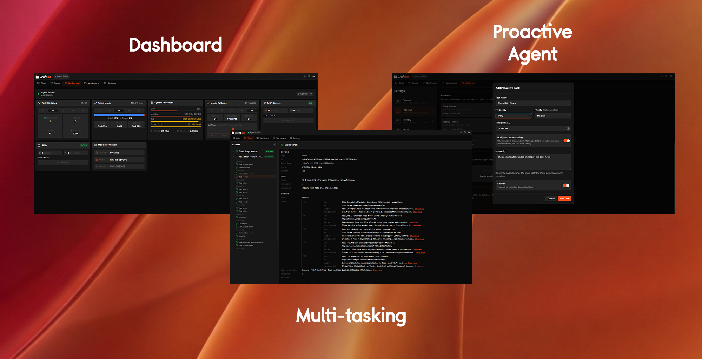
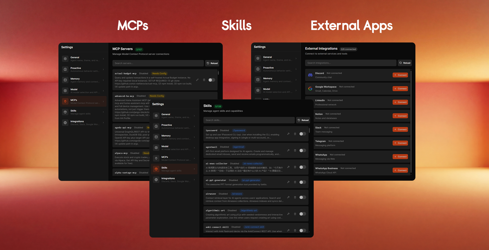
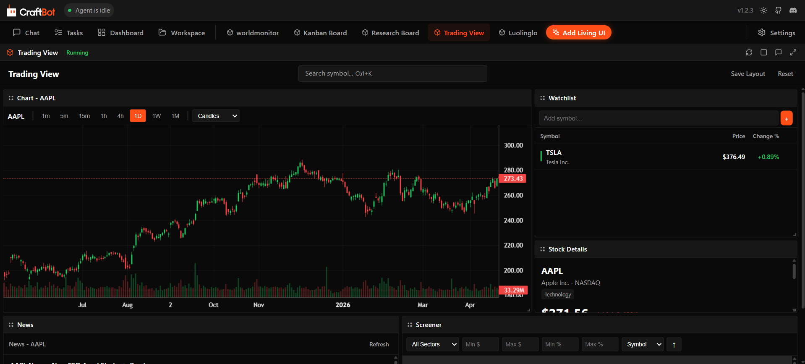
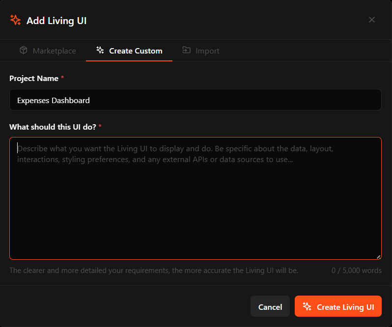
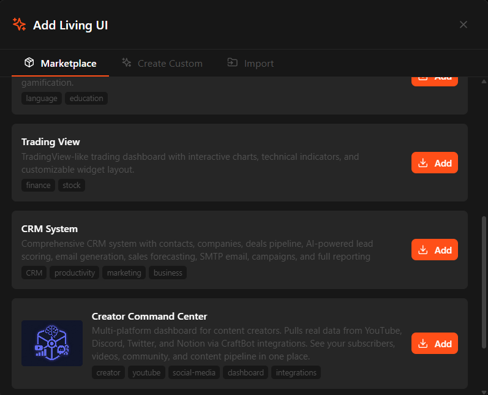
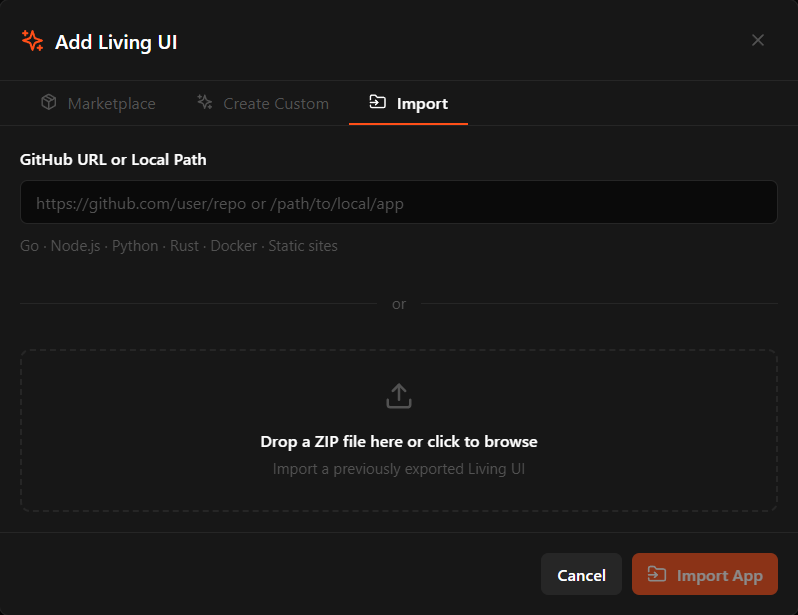

<div align="center">
    
</div>
<br>

<div align="center">
  
  
  

  <a href="https://github.com/CraftOS-dev/CraftBot">
    
  </a>

  

  <a href="https://discord.gg/ZN9YHc37HG">
    
  </a>
<br/>
<br/>

[](https://e2b.dev/startups)

<a href="https://www.producthunt.com/products/craftbot?embed=true&amp;utm_source=badge-top-post-badge&amp;utm_medium=badge&amp;utm_campaign=badge-craftbot" target="_blank" rel="noopener noreferrer"></a>
</div>

<p align="center">
  <a href="README.md">English</a> | <a href="README.ja.md">日本語</a> | <a href="README.cn.md">简体中文</a> | <a href="README.zh-TW.md">繁體中文</a> | <a href="README.ko.md">한국어</a> | <a href="README.es.md">Español</a> | <a href="README.pt-BR.md">Português</a> | <a href="README.de.md">Deutsch</a>
</p>

## 🚀 Aperçu
<h3 align="center">
CraftBot est votre Assistant IA Personnel qui vit à l'intérieur de votre machine et travaille 24h/24 pour vous.
</h3>

Il interprète les tâches de manière autonome, planifie les actions et les exécute pour atteindre vos objectifs.
Il apprend vos préférences et objectifs, et vous aide de façon proactive à planifier et lancer des tâches pour atteindre vos buts de vie.
Les MCP, les Skills et les intégrations d'applications externes sont pris en charge.

CraftBot attend vos ordres. Configurez dès maintenant votre propre CraftBot.

<div align="center">
    
</div>

---

## ✨ Fonctionnalités

- **Bring Your Own Key (BYOK)** — Système flexible de fournisseurs LLM prenant en charge OpenAI, Google Gemini, Anthropic Claude, BytePlus et les modèles locaux Ollama. Basculez facilement entre fournisseurs.
- **Système de mémoire** — Distille et consolide les événements de la journée à minuit.
- **Agent proactif** — Apprend vos préférences, habitudes et objectifs de vie. Puis planifie et lance des tâches (avec votre accord, bien sûr) pour vous aider à progresser.
- **Living UI** — Créez, importez ou faites évoluer des applications personnalisées qui vivent au sein de CraftBot. L'agent reste conscient de l'état de l'UI et peut lire, écrire et agir directement sur ses données.
- **Intégration d'outils externes** — Connectez-vous à Google Workspace, Slack, Notion, Zoom, LinkedIn, Discord et Telegram (d'autres à venir !) avec des identifiants intégrés et le support OAuth.
- **MCP** — Intégration du Model Context Protocol pour étendre les capacités de l'agent avec des outils et services externes.
- **Skills** — Framework de skills extensible avec des skills intégrées pour la planification de tâches, la recherche, la revue de code, les opérations git, etc.
- **Multiplateforme** — Prise en charge complète de Windows, macOS et Linux avec des variantes de code spécifiques à chaque plateforme et la conteneurisation Docker.

> [!IMPORTANT]
> **Le mode GUI est déprécié.** CraftBot ne prend plus en charge le mode GUI (automatisation de bureau). Utilisez plutôt le mode Browser, TUI ou CLI.

<div align="center">
    
	
</div>

---


## 🧰 Pour commencer

### Prérequis
- Python **3.10+**
- `git` (nécessaire pour cloner le dépôt)
- Une clé API pour le fournisseur LLM de votre choix (OpenAI, Gemini ou Anthropic)
- `Node.js` **18+** (optionnel — requis uniquement pour l'interface navigateur)
- `conda` (optionnel — s'il est introuvable, l'installateur propose d'installer Miniconda automatiquement)

### Installation rapide

```bash
# Cloner le dépôt
git clone https://github.com/CraftOS-dev/CraftBot.git
cd CraftBot

# Installer les dépendances
python install.py

# Lancer l'agent
python run.py
```

C'est tout ! La première exécution vous guidera dans la configuration de vos clés API.

**Remarque :** Si Node.js n'est pas installé, l'installateur fournira des instructions pas à pas. Vous pouvez aussi ignorer le mode navigateur et utiliser la TUI (voir les modes ci-dessous).

### Que pouvez-vous faire tout de suite ?
- Discuter avec l'agent naturellement
- Lui demander d'exécuter des tâches complexes en plusieurs étapes
- Taper `/help` pour voir les commandes disponibles
- Vous connecter à Google, Slack, Notion et plus

### 🖥️ Modes d'interface

<div align="center">
    
</div>

CraftBot propose plusieurs modes d'UI. Choisissez selon vos préférences :

| Mode | Commande | Prérequis | Idéal pour |
|------|---------|--------------|----------|
| **Browser** | `python run.py` | Node.js 18+ | Interface web moderne, la plus simple à utiliser |
| **TUI** | `python run.py --tui` | Aucun | UI en terminal, aucune dépendance requise |
| **CLI** | `python run.py --cli` | Aucun | Ligne de commande, léger |

Le **mode navigateur** est le mode par défaut et recommandé. Si vous n'avez pas Node.js, l'installateur vous guidera pour l'installer, ou vous pouvez utiliser le **mode TUI**.

---

## 🧬 Living UI

**Living UI est un système/une application/un tableau de bord qui évolue avec vos besoins.**

Besoin d'un tableau kanban avec un copilote IA intégré ? D'un CRM sur mesure taillé
exactement pour votre flux de travail ? D'un tableau de bord d'entreprise que CraftBot
peut lire et piloter pour vous ? Lancez-le comme une Living UI — elle tourne aux côtés
de CraftBot et grandit au rythme de vos besoins.

<div align="center">
    
</div>

### Trois façons de créer une Living UI

1. **Construire à partir de zéro.** Décrivez ce que vous voulez en langage naturel.
   CraftBot met en place le modèle de données, l'API backend et l'interface React,
   et itère avec vous à travers un processus de conception structuré.

<div align="center">
    
</div>

2. **Installer depuis la marketplace.** Parcourez les Living UIs créées par la communauté sur [living-ui-marketplace](https://github.com/CraftOS-dev/living-ui-marketplace).

<div align="center">
    
</div>

3. **Importer un projet existant.** Pointez CraftBot vers un code source ou un dépôt
   GitHub en Go, Node.js, Python, Rust ou statique. Il détecte le runtime, configure
   les vérifications de santé et l'encapsule en Living UI.

<div align="center">
    
</div>

### Continue d'évoluer

Une Living UI n'est jamais « terminée ». Demandez à l'agent d'ajouter des
fonctionnalités, de repenser une vue ou de la brancher à de nouvelles données
à mesure que vos besoins évoluent.

### CraftBot dans la boucle

CraftBot est intégré à chaque Living UI et **conscient de son état** :
il peut lire le DOM courant et les valeurs des formulaires, interroger les
données de l'app via l'API REST, et déclencher des actions en votre nom.

---

## 🧩 Aperçu de l'architecture

| Composant | Description |
|-----------|-------------|
| **Agent Base** | Couche d'orchestration centrale qui gère le cycle de vie des tâches, coordonne les composants et pilote la boucle agentique principale. |
| **LLM Interface** | Interface unifiée prenant en charge plusieurs fournisseurs LLM (OpenAI, Gemini, Anthropic, BytePlus, Ollama). |
| **Context Engine** | Génère des prompts optimisés avec support du cache KV. |
| **Action Manager** | Récupère et exécute les actions depuis la bibliothèque. Les actions personnalisées sont faciles à étendre. |
| **Action Router** | Sélectionne intelligemment l'action la plus adaptée aux exigences de la tâche et résout les paramètres d'entrée via le LLM au besoin. |
| **Event Stream** | Système de publication d'événements en temps réel pour le suivi de la progression des tâches, les mises à jour d'UI et le monitoring d'exécution. |
| **Memory Manager** | Mémoire sémantique basée sur le RAG via ChromaDB. Gère le découpage, l'embedding, la récupération et les mises à jour incrémentales. |
| **State Manager** | Gestion globale de l'état pour suivre le contexte d'exécution de l'agent, l'historique de conversation et la configuration d'exécution. |
| **Task Manager** | Gère les définitions de tâches, permet des modes simples et complexes, crée des to-dos et suit les workflows multi-étapes. |
| **Skill Manager** | Charge et injecte des skills enfichables dans le contexte de l'agent. |
| **MCP Adapter** | Intégration Model Context Protocol qui convertit les outils MCP en actions natives. |
| **TUI Interface** | Interface utilisateur en terminal construite avec le framework Textual pour une utilisation interactive en ligne de commande. |

---

## 🔜 Roadmap

- [X] **Module de mémoire** — Terminé.
- [ ] **Intégration d'outils externes** — En cours d'ajout !
- [X] **Couche MCP** — Terminée.
- [X] **Couche Skills** — Terminée.
- [ ] **Comportement proactif** — En cours

---

## 📋 Référence des commandes

### install.py

| Flag | Description |
|------|-------------|
| `--conda` | Utiliser un environnement conda (optionnel) |

### run.py

| Flag | Description |
|------|-------------|
| (aucun) | Lancer en mode **Browser** (recommandé, nécessite Node.js) |
| `--tui` | Lancer en mode **Terminal UI** (aucune dépendance) |
| `--cli` | Lancer en mode **CLI** (léger) |

### service.py

| Commande | Description |
|---------|-------------|
| `install` | Installe les deps, enregistre le démarrage automatique et lance CraftBot |
| `start` | Démarre CraftBot en arrière-plan |
| `stop` | Arrête CraftBot |
| `restart` | Arrête puis redémarre |
| `status` | Affiche l'état d'exécution et celui du démarrage automatique |
| `logs [-n N]` | Affiche les N dernières lignes de log (par défaut : 50) |
| `uninstall` | Supprime l'enregistrement du démarrage automatique |

**Exemples d'installation :**
```bash
# Installation simple via pip (sans conda)
python install.py

# Avec environnement conda (recommandé pour les utilisateurs de conda)
python install.py --conda
```

**Exécuter CraftBot :**

```powershell
# Mode Browser (par défaut, nécessite Node.js)
python run.py

# Mode TUI (pas de Node.js nécessaire)
python run.py --tui

# Mode CLI (léger)
python run.py --cli

# Avec environnement conda
conda run -n craftbot python run.py

# Ou en utilisant le chemin complet si conda n'est pas dans le PATH
&"$env:USERPROFILE\miniconda3\Scripts\conda.exe" run -n craftbot python run.py
```

**Linux/macOS (Bash) :**
```bash
# Mode Browser (par défaut, nécessite Node.js)
python run.py

# Mode TUI (pas de Node.js nécessaire)
python run.py --tui

# Mode CLI (léger)
python run.py --cli

# Avec environnement conda
conda run -n craftbot python run.py
```

### 🔧 Service en arrière-plan (recommandé)

Exécutez CraftBot en tant que service en arrière-plan pour qu'il continue de fonctionner même après la fermeture du terminal. Un raccourci de bureau est créé automatiquement pour rouvrir le navigateur à tout moment.

```bash
# Installer les dépendances, enregistrer le démarrage automatique à la connexion et lancer CraftBot
python service.py install
```

C'est tout. Le terminal se ferme tout seul, CraftBot tourne en arrière-plan et le navigateur s'ouvre automatiquement.

```bash
# Autres commandes du service :
python service.py start    # Démarre CraftBot en arrière-plan
python service.py status   # Vérifie s'il tourne
python service.py stop     # Arrête CraftBot
python service.py restart  # Redémarre CraftBot
python service.py logs     # Affiche les logs récents
```

| Commande | Description |
|---------|-------------|
| `python service.py install` | Installe les dépendances, enregistre le démarrage automatique à la connexion, lance CraftBot, ouvre le navigateur et ferme le terminal automatiquement |
| `python service.py start` | Démarre CraftBot en arrière-plan — redémarre automatiquement s'il est déjà lancé (le terminal se ferme tout seul) |
| `python service.py stop` | Arrête CraftBot |
| `python service.py restart` | Arrête puis démarre CraftBot |
| `python service.py status` | Vérifie si CraftBot tourne et si le démarrage automatique est activé |
| `python service.py logs` | Affiche les logs récents (`-n 100` pour plus de lignes) |
| `python service.py uninstall` | Arrête CraftBot, supprime le démarrage automatique, désinstalle les paquets pip et purge le cache pip |

> [!TIP]
> Après `service.py start` ou `service.py install`, un **raccourci CraftBot sur le bureau** est créé automatiquement. Si vous fermez le navigateur par accident, double-cliquez sur le raccourci pour le rouvrir.

> [!NOTE]
> **Installation :** L'installateur fournit maintenant des indications claires si des dépendances manquent. Si Node.js est introuvable, on vous proposera de l'installer ou de basculer en mode TUI. L'installation détecte automatiquement la disponibilité du GPU et bascule en mode CPU si nécessaire.

> [!TIP]
> **Première configuration :** CraftBot vous guidera dans une séquence d'onboarding pour configurer les clés API, le nom de l'agent, les MCP et les Skills.

> [!NOTE]
> **Playwright Chromium :** Optionnel pour l'intégration WhatsApp Web. Si l'installation échoue, l'agent fonctionnera toujours pour les autres tâches. Installez-le manuellement plus tard avec : `playwright install chromium`

---

## 🔧 Dépannage et problèmes courants

### Node.js manquant (pour le mode navigateur)
Si vous voyez **"npm not found in PATH"** en lançant `python run.py` :
1. Téléchargez depuis [nodejs.org](https://nodejs.org/) (choisissez la version LTS)
2. Installez et redémarrez votre terminal
3. Relancez `python run.py`

**Alternative :** Utilisez le mode TUI (Node.js non requis) :
```bash
python run.py --tui
```

### L'installation échoue sur les dépendances
L'installateur fournit désormais des messages d'erreur détaillés avec des solutions. Si l'installation échoue :
- **Vérifiez la version de Python :** assurez-vous d'avoir Python 3.10+ (`python --version`)
- **Vérifiez votre connexion :** les dépendances sont téléchargées pendant l'installation
- **Videz le cache pip :** `pip install --upgrade pip` puis réessayez

### Problèmes d'installation de Playwright
L'installation de Playwright Chromium est optionnelle. En cas d'échec :
- L'agent **continuera de fonctionner** pour les autres tâches
- Vous pouvez l'ignorer ou l'installer plus tard : `playwright install chromium`
- Nécessaire uniquement pour l'intégration WhatsApp Web

Pour un dépannage détaillé, consultez [INSTALLATION_FIX.md](INSTALLATION_FIX.md).

---

## 🔌 Intégration des services externes

L'agent peut se connecter à divers services via OAuth. Les builds de release incluent des identifiants intégrés, mais vous pouvez aussi utiliser les vôtres.

### Démarrage rapide

Pour les builds de release avec identifiants intégrés :
```
/google login    # Connecter Google Workspace
/zoom login      # Connecter Zoom
/slack invite    # Connecter Slack
/notion invite   # Connecter Notion
/linkedin login  # Connecter LinkedIn
```

### Détails des services

| Service | Type d'auth | Commande | Secret requis ? |
|---------|-----------|---------|------------------|
| Google | PKCE | `/google login` | Non (PKCE) |
| Zoom | PKCE | `/zoom login` | Non (PKCE) |
| Slack | OAuth 2.0 | `/slack invite` | Oui |
| Notion | OAuth 2.0 | `/notion invite` | Oui |
| LinkedIn | OAuth 2.0 | `/linkedin login` | Oui |

### Utiliser vos propres identifiants

Si vous préférez utiliser vos propres identifiants OAuth, ajoutez-les à votre fichier `.env` :

#### Google (PKCE — uniquement le Client ID)
```bash
GOOGLE_CLIENT_ID=your-client-id.apps.googleusercontent.com
```
1. Allez sur la [Google Cloud Console](https://console.cloud.google.com/)
2. Activez les API Gmail, Calendar, Drive et People
3. Créez des identifiants OAuth de type **Desktop app**
4. Copiez le Client ID (le secret n'est pas requis en PKCE)

#### Zoom (PKCE — uniquement le Client ID)
```bash
ZOOM_CLIENT_ID=your-zoom-client-id
```
1. Allez sur le [Zoom Marketplace](https://marketplace.zoom.us/)
2. Créez une application OAuth
3. Copiez le Client ID

#### Slack (les deux requis)
```bash
SLACK_SHARED_CLIENT_ID=your-slack-client-id
SLACK_SHARED_CLIENT_SECRET=your-slack-client-secret
```
1. Allez sur [Slack API](https://api.slack.com/apps)
2. Créez une nouvelle application
3. Ajoutez les scopes OAuth : `chat:write`, `channels:read`, `users:read`, etc.
4. Copiez le Client ID et le Client Secret

#### Notion (les deux requis)
```bash
NOTION_SHARED_CLIENT_ID=your-notion-client-id
NOTION_SHARED_CLIENT_SECRET=your-notion-client-secret
```
1. Allez sur [Notion Developers](https://developers.notion.com/)
2. Créez une nouvelle intégration (Public integration)
3. Copiez l'OAuth Client ID et le Secret

#### LinkedIn (les deux requis)
```bash
LINKEDIN_CLIENT_ID=your-linkedin-client-id
LINKEDIN_CLIENT_SECRET=your-linkedin-client-secret
```
1. Allez sur [LinkedIn Developers](https://developer.linkedin.com/)
2. Créez une application
3. Ajoutez les scopes OAuth 2.0
4. Copiez le Client ID et le Client Secret

---
## 🐳 Exécuter avec un conteneur

La racine du dépôt contient une configuration Docker avec Python 3.10, des paquets système clés (dont Tesseract pour l'OCR) et toutes les dépendances Python définies dans `environment.yml`/`requirements.txt`, pour que l'agent s'exécute de façon cohérente dans des environnements isolés.

Ci-dessous les instructions pour exécuter notre agent en conteneur.

### Construire l'image

Depuis la racine du dépôt :

```bash
docker build -t craftbot .
```

### Exécuter le conteneur

L'image est configurée pour lancer l'agent avec `python -m app.main` par défaut. Pour l'exécuter en mode interactif :

```bash
docker run --rm -it craftbot
```

Si vous devez fournir des variables d'environnement, passez un fichier env (par exemple basé sur `.env.example`) :

```bash
docker run --rm -it --env-file .env craftbot
```

Montez tous les répertoires qui doivent persister en dehors du conteneur (comme les dossiers de données ou cache) via `-v`, et ajustez les ports ou autres flags selon votre déploiement. L'image embarque les dépendances système pour l'OCR (`tesseract`) et les clients HTTP courants, afin que l'agent puisse travailler avec les fichiers et les API réseau dans le conteneur.

Par défaut, l'image utilise Python 3.10 et embarque les dépendances Python de `environment.yml`/`requirements.txt`, donc `python -m app.main` fonctionne immédiatement.

---

## 🤝 Comment contribuer

Les PR sont les bienvenues ! Voir [CONTRIBUTING.md](CONTRIBUTING.md) pour le workflow (fork → branche depuis `dev` → PR). Toutes les pull requests passent automatiquement par un CI lint + smoke-test. Pour toute question ou une discussion plus rapide, rejoignez-nous sur [Discord](https://discord.gg/ZN9YHc37HG) ou envoyez un email à thamyikfoong(at)craftos.net.

## 🧾 Licence

Ce projet est sous [licence MIT](LICENSE). Vous êtes libre d'utiliser, d'héberger et de monétiser ce projet (vous devez créditer ce projet en cas de distribution et de monétisation).

---

## ⭐ Remerciements

Développé et maintenu par [CraftOS](https://craftos.net/) et les contributeurs [@zfoong](https://github.com/zfoong) et [@ahmad-ajmal](https://github.com/ahmad-ajmal).
Si **CraftBot** vous est utile, mettez une ⭐ au dépôt et partagez-le avec d'autres !

---

## Star History

<a href="https://www.star-history.com/?repos=CraftOS-dev%2FCraftBot&type=date&legend=top-left">
 <picture>
   <source media="(prefers-color-scheme: dark)" srcset="https://api.star-history.com/chart?repos=CraftOS-dev/CraftBot&type=date&theme=dark&legend=top-left" />
   <source media="(prefers-color-scheme: light)" srcset="https://api.star-history.com/chart?repos=CraftOS-dev/CraftBot&type=date&legend=top-left" />
   
 </picture>
</a>
