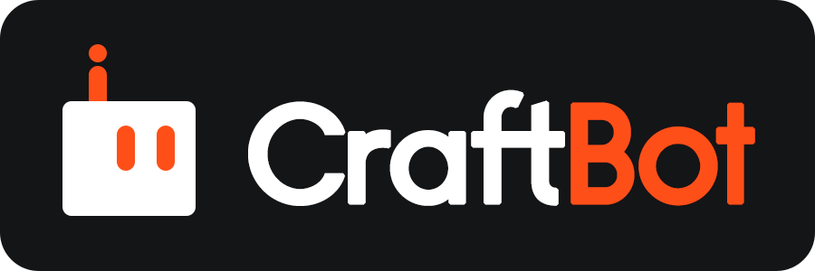

<div align="center">
    
</div>
<br>
<div align="center">
    
</div>
<br>

<div align="center">
  
  
  
  <a href="https://github.com/zfoong/CraftBot">
    
  </a>

  

  <a href="https://discord.gg/ZN9YHc37HG">
    
  </a>
<br/>
<br/>

[](https://e2b.dev/startups)
</div>

<p align="center">
  <a href="README.ja.md"> 日本語版はこちら</a> | <a href="README.cn.md"> 中文版README </a>
</p>

## 🚀 Overview
<h3 align="center">
CraftBot is your Personal AI Assistant that lives inside your machine and works 24/7 for you. 
</h3>

It autonomously interprets tasks, plans actions, and executes them to achieve your goals.

Set up CraftBot on your machine or a separate environment. Interact with it via the TUI or from anywhere through your favorite messaging apps. Extend the agent's capabilities with MCPs and Skills, and connect to tools like Google Workspace, Slack, Notion, and Telegram to expand its reach. CraftBot intelligently switches between CLI mode for standard tasks and GUI mode when screen interaction is required (GUI mode runs in an isolated environment so it won't disturb your work).

CraftBot awaits your orders, set up your own CraftBot now.

---

## ✨ Features

- **CLI/GUI Mode** — Agent intelligently switches between CLI and GUI mode based on task complexity. GUI mode enables full desktop automation with screen capture, mouse/keyboard control, and window management.
- **Multi-LLM Support** — Flexible LLM provider system supporting OpenAI, Google Gemini, Anthropic Claude, BytePlus, and local Ollama models. Easily switch between providers.
- **37+ Built-in Actions** — Comprehensive action library including:
  - **File Operations**: Find, read, write, grep, and convert files
  - **Web Capabilities**: HTTP requests, web search, PDF generation, image generation
  - **GUI Automation**: Mouse clicks, keyboard input, screenshots, window control
  - **Application Control**: Open apps, manage windows, clipboard operations
- **Persistent Memory** — RAG-based semantic memory system powered by ChromaDB. The agent remembers context across sessions with intelligent retrieval and incremental updates.
- **External tools integration** — Connect to Google Workspace, Slack, Notion, Zoom, LinkedIn, Discord, and Telegram (more to come!) with embedded credentials and OAuth support.
- **MCP** — Model Context Protocol integration for extending agent capabilities with external tools and services.
- **Skills** — Extensible skill framework with built-in skills for task planning, research, code review, git operations, and more.
- **Cross-Platform** — Full support for Windows and Linux with platform-specific code variants and Docker containerization.

> [!IMPORTANT]
> **Note for GUI mode:** The GUI mode is still in experimental phase. This means you may encounter issues when the agent switches to GUI mode. We are actively improving this feature.

---

## 🧰 Getting Started

### Prerequisites
- Python **3.10+**
- `git` and `conda` (or `pip`)
- An API key for your chosen LLM provider (OpenAI, Gemini, or Anthropic)

### Quick Install

```bash
# Clone the repository
git clone https://github.com/zfoong/CraftBot.git
cd CraftBot

# Install dependencies
python install.py

# Run the agent
python run.py
```

That's it! The first run will guide you through setting up your API keys.

### What you can do right after?
- Talk to the agent naturally
- Ask it to perform complex multi-step tasks
- Type `/help` to see available commands
- Connect to Google, Slack, Notion, and more

---

## 🧩 Architecture Overview

| Component | Description |
|-----------|-------------|
| **Agent Base** | Core orchestration layer that manages task lifecycle, coordinates between components, and handles the main agentic loop. |
| **LLM Interface** | Unified interface supporting multiple LLM providers (OpenAI, Gemini, Anthropic, BytePlus, Ollama). |
| **Context Engine** | Generates optimized prompts with KV-cache support. |
| **Action Manager** | Retrieves and executes actions from the library. Custom action is easy to extend |
| **Action Router** | Intelligently selects the best matching action based on task requirements and resolves input parameters via LLM when needed. |
| **Event Stream** | Real-time event publishing system for task progress tracking, UI updates, and execution monitoring. |
| **Memory Manager** | RAG-based semantic memory using ChromaDB. Handles memory chunking, embedding, retrieval, and incremental updates. |
| **State Manager** | Global state management for tracking agent execution context, conversation history, and runtime configuration. |
| **Task Manager** | Manages task definitions, enable simple and complex tasks bode, create todos, and multi-step workflow tracking. |
| **Skill Manager** | Loads and injects pluggable skills into the agent context. |
| **MCP Adapter** | Model Context Protocol integration that converts MCP tools into native actions. |
| **TUI Interface** | Terminal user interface built with Textual framework for interactive command-line operation. |
| **GUI Module** | Experimental GUI automation using Docker containers, OmniParser for UI element detection, and Gradio client. |

---

## 🔜 Roadmap

- [X] **Memory Module** — Done.
- [ ] **External Tool integration** — Still adding more!
- [X] **MCP Layer** — Done.
- [X] **Skill Layer** — Done.
- [ ] **Proactive Behaviour** — Pending

---

## 🖥️ GUI Mode (Optional)

GUI mode enables screen automation - the agent can see and interact with a desktop environment.

```bash
# Install with GUI support
python install.py --gui

# Run with GUI mode
python run.py --gui
```

> [!NOTE]
> GUI mode is experimental and requires additional dependencies (~4GB for model weights).

---

## 📋 Command Reference

### install.py

| Flag | Description |
|------|-------------|
| `--gui` | Install GUI components (OmniParser) |
| `--no-conda` | Use global pip instead of conda |
| `--cpu-only` | Install CPU-only PyTorch (with --gui) |

### run.py

| Flag | Description |
|------|-------------|
| `--gui` | Enable GUI mode (requires `install.py --gui` first) |
| `--no-conda` | Use global pip instead of conda |

**Examples:**
```bash


'''
# Basic install and run
python install.py
python run.py

# Install with GUI support
python install.py --gui
python run.py --gui

# Use pip instead of conda
python install.py --no-conda
python run.py --no-conda
*/
'''
python install.py              # Global pip (fastest, minimal deps)
python install.py --conda      # Conda environment
python install.py --gui --conda # Full installation with GUI components

python run.py              # For global pip install
python run.py              # For conda environment (no flag needed, conda is automatic)
python run.py --gui        # For full installation with GUI components
```

> [!TIP]
> **First-time setup:** CraftBot will guide you through an onboarding sequence to configure API keys, the agent's name, MCPs, and Skills.

---

## 🔐 OAuth Setup (Optional)

The agent can connect to various services using OAuth. Release builds come with embedded credentials, but you can also use your own.

### Quick Start

For release builds with embedded credentials:
```
/google login    # Connect Google Workspace
/zoom login      # Connect Zoom
/slack invite    # Connect Slack
/notion invite   # Connect Notion
/linkedin login  # Connect LinkedIn
```

### Service Details

| Service | Auth Type | Command | Requires Secret? |
|---------|-----------|---------|------------------|
| Google | PKCE | `/google login` | No (PKCE) |
| Zoom | PKCE | `/zoom login` | No (PKCE) |
| Slack | OAuth 2.0 | `/slack invite` | Yes |
| Notion | OAuth 2.0 | `/notion invite` | Yes |
| LinkedIn | OAuth 2.0 | `/linkedin login` | Yes |

### Using Your Own Credentials

If you prefer to use your own OAuth credentials, add them to your `.env` file:

#### Google (PKCE - only Client ID needed)
```bash
GOOGLE_CLIENT_ID=your-client-id.apps.googleusercontent.com
```
1. Go to [Google Cloud Console](https://console.cloud.google.com/)
2. Enable Gmail, Calendar, Drive, and People APIs
3. Create OAuth credentials as **Desktop app** type
4. Copy the Client ID (secret not required for PKCE)

#### Zoom (PKCE - only Client ID needed)
```bash
ZOOM_CLIENT_ID=your-zoom-client-id
```
1. Go to [Zoom Marketplace](https://marketplace.zoom.us/)
2. Create an OAuth app
3. Copy the Client ID

#### Slack (Requires both)
```bash
SLACK_SHARED_CLIENT_ID=your-slack-client-id
SLACK_SHARED_CLIENT_SECRET=your-slack-client-secret
```
1. Go to [Slack API](https://api.slack.com/apps)
2. Create a new app
3. Add OAuth scopes: `chat:write`, `channels:read`, `users:read`, etc.
4. Copy Client ID and Client Secret

#### Notion (Requires both)
```bash
NOTION_SHARED_CLIENT_ID=your-notion-client-id
NOTION_SHARED_CLIENT_SECRET=your-notion-client-secret
```
1. Go to [Notion Developers](https://developers.notion.com/)
2. Create a new integration (Public integration)
3. Copy OAuth Client ID and Secret

#### LinkedIn (Requires both)
```bash
LINKEDIN_CLIENT_ID=your-linkedin-client-id
LINKEDIN_CLIENT_SECRET=your-linkedin-client-secret
```
1. Go to [LinkedIn Developers](https://developer.linkedin.com/)
2. Create an app
3. Add OAuth 2.0 scopes
4. Copy Client ID and Client Secret

---
## Run with container

The repository root included a Docker configuration with Python 3.10, key system packages (including Tesseract for OCR), and all Python dependencies defined in `environment.yml`/`requirements.txt` so the agent can run consistently in isolated environments. 

Below are the setup instruction of running our agent with container.

### Build the image

From the repository root:

```bash
docker build -t craftbot .
```

### Run the container

The image is configured to launch the agent with `python -m app.main` by default. To run it interactively:

```bash
docker run --rm -it craftbot
```

If you need to supply environment variables, pass an env file (for example, based on `.env.example`):

```bash
docker run --rm -it --env-file .env craftbot
```

Mount any directories that should persist outside the container (such as data or cache folders) using `-v`, and adjust ports or additional flags as needed for your deployment. The container ships with system dependencies for OCR (`tesseract`), screen automation (`pyautogui`, `mss`, X11 utilities, and a virtual framebuffer), and common HTTP clients so the agent can work with files, network APIs, and GUI automation inside the container.

### Enabling GUI/screen automation

GUI actions (mouse/keyboard events, screenshots) require an X11 server. You can either attach to your host display or run headless with `xvfb`:

* Use the host display (requires Linux with X11):

  ```bash
  docker run --rm -it 
    -e DISPLAY=$DISPLAY \
    -v /tmp/.X11-unix:/tmp/.X11-unix \
    -v $(pwd)/data:/app/app/data \
    craftbot
  ```

  Add extra `-v` mounts for any folders the agent should read/write.

* Run headlessly with a virtual display:

  ```bash
	docker run --rm -it --env-file .env craftbot bash -lc "Xvfb :99 -screen 0 1920x1080x24 & export DISPLAY=:99 && exec python -m app.main"
  ```

By default the image uses Python 3.10 and bundles the Python dependencies from `environment.yml`/`requirements.txt`, so `python -m app.main` works out of the box.

---

## 🤝 How to Contribute

Contributions and suggestions are welcome! You can contact [@zfoong](https://github.com/zfoong) @ thamyikfoong(at)craftos.net. We currently don't have checks set up, so we can't allow direct contributions but we appreciate any suggestions and feedback.

## 🧾 License

This project is licensed under the [MIT License](LICENSE). You are free to use, host, and monetize this project (you must credit this project in case of distribution and monetization).

---

## ⭐ Acknowledgements

Developed and maintained by [CraftOS](https://craftos.net/) and contributors [@zfoong](https://github.com/zfoong) and [@ahmad-ajmal](https://github.com/ahmad-ajmal).  
If you find **CraftBot** useful, please ⭐ the repository and share it with others!
